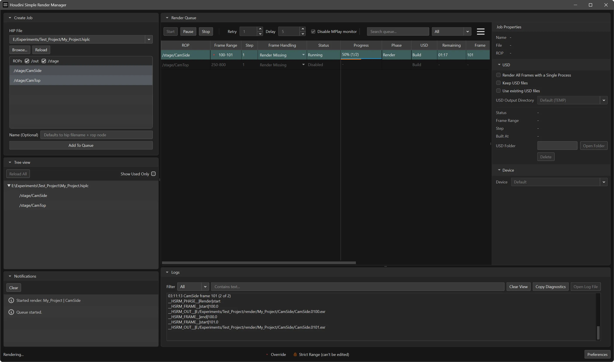

# Houdini Simple Render Manager

Local desktop queue manager for Houdini renders (PySide6 UI + hbatch/husk workflow).



## Requirements

- Python 3.12
- `PySide6`
- Houdini installed locally
- Access to `hbatch.exe` configured in app preferences
- `husk` available if you use Solaris/USD rendering workflows

## Install

```bat
pip install -r requirements.txt
```

## Build Executable

Install the build dependency:

```bat
pip install -r requirements-build.txt
```

Then build the Windows executable bundle:

```bat
build_exe.bat
```

This produces an `onedir` build under `dist/HoudiniSimpleRenderManager/`:

- `HoudiniSimpleRenderManager.exe`
- `scan_worker.exe`
- `render_worker.exe`
- bundled `assets/`
- bundled `houdini_scripts/`

Why this layout:

- the main app is built as `onedir` for simpler debugging and more predictable Qt packaging
- worker subprocesses are built as separate executables so the frozen GUI app does not need to launch Python scripts directly
- Houdini itself is still an external dependency; bundling this app does not bundle Houdini

## Run

```bat
run_houdini_simple_render_manager.bat
```

Or:

```bat
python houdini_simple_render_manager.py
```

## Test

```bat
python -m unittest discover -s tests
```

## Project Layout

- `houdini_simple_render_manager.py`
  Main application window and composition root.
- `run_houdini_simple_render_manager.bat`
  Windows launcher for the app.
- `render_worker.py`, `scan_worker.py`, `gui_smoke.py`
  Root entry scripts kept for subprocess/compatibility usage.
- `app_core/`
  Shared app policies/utilities (validation, notifications, diagnostics, atomic I/O).
- `flows/`
  High-level orchestration helpers extracted from the main window.
- `houdini_core/`
  Houdini probing/scan bridge and worker-side Houdini services.
- `job_core/`
  Job properties actions/presenter/state helpers.
- `queue_core/`
  Queue domain models, lifecycle, persistence, table/filter/progress helpers, and queue UI coordinators.
- `render_core/`
  Render runtime/session/worker helpers.
- `usd_core/`
  Retained USD policy/runtime/panel helpers and USD queue status helpers.
- `ui_core/`
  UI widgets, theme helpers, layout policies, and splitter/layout coordinators.
- `worker_core/`
  Worker protocol/client transport helpers.
- `tests/`
  Unit tests for all modules.

## Architecture Notes

- `houdini_simple_render_manager.py` is the composition root, but most UI/state policy has been extracted into focused coordinators.
- `ui_core/window_layout_coordinator.py`, `ui_core/panel_splitter_coordinator.py`, and `ui_core/layout_policies.py` own pane sizing, splitter behavior, and startup layout reconciliation.
- `queue_core/queue_view_state_coordinator.py`, `queue_core/queue_refresh_coordinator.py`, `queue_core/queue_state_coordinator.py`, `queue_core/queue_context_menu_coordinator.py`, and `queue_core/queue_tree_context_menu_coordinator.py` own queue view restoration, refresh orchestration, persistence, and context-menu behavior.
- `houdini_core/tree_scan_coordinator.py` and `houdini_core/scan_coordinator.py` own Houdini scan integration and queue-tree scan state.
- Notification icons are bundled from Tabler Icons under MIT. See `assets/third_party/tabler/`.

## Import Conventions

- Shared app helpers are imported from `app_core.*`.
- Houdini integration helpers are imported from `houdini_core.*`.
- Job property helpers are imported from `job_core.*`.
- Queue modules are imported from `queue_core.*` (not top-level `queue_*` files).
- Render runtime helpers are imported from `render_core.*`.
- Retained USD modules are imported from `usd_core.*`.
- UI shared modules are imported from `ui_core.*`.
- Worker transport/protocol helpers are imported from `worker_core.*`.
- Orchestration helpers are imported from `flows.*`.
- `queue_core/` is used instead of `queue/` to avoid name collision with Python's stdlib `queue` module.
